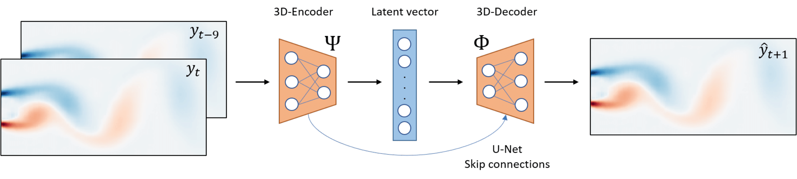
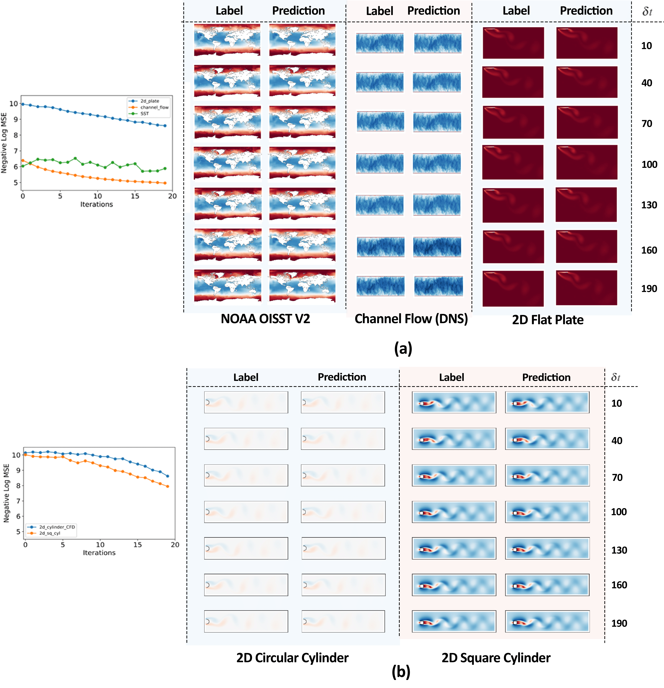
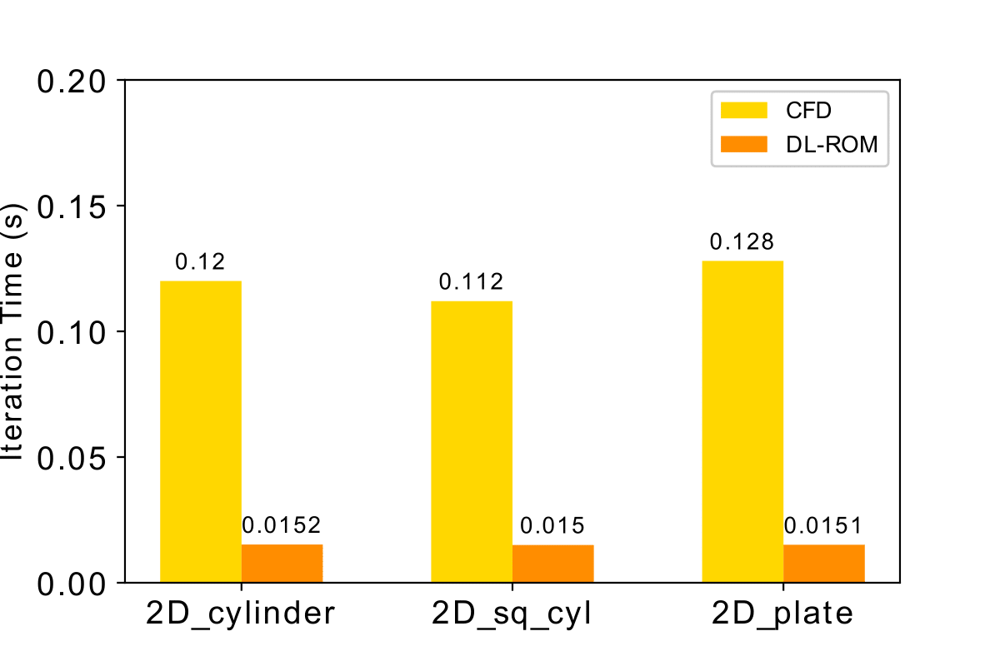

# DL-ROM : Deep Learning for Reduced Order Modelling 

## Overview

This repository contains the implementation of DL-ROM: [Deep Learning for Reduced Order Modelling and Efficient Temporal Evolution of Fluid Simulations](http://arxiv.org/abs/2107.04556)


## About DL-ROM:

Reduced Order Modeling (ROM) has been widely used to create lower order, computationally inexpensive representations of higher order dynamical systems. Using these representations, ROMs can efficiently model flow-fields while using significantly lesser parameters. Conventional ROMs accomplish this by linearly projecting higher order manifolds to lower-dimensional space using dimensionality reduction techniques such as Proper Orthogonal Decomposition (POD). In this work, we develop a novel deep learning framework DL-ROM (Deep Learning - Reduced Order Modelling) to create a neural network capable of non-linear projections to reduced order states. We then use the learned reduced state to efficiently predict future time steps of the simulation using 3D Autoencoder and 3D U-Net based architectures. Our model DL-ROM is able to create highly accurate reconstructions from the learned ROM and is thus able to efficiently predict future time steps by temporally traversing in the learned reduced state. All of this is achieved without ground truth supervision or needing to iteratively solve the expensive Navier-Stokes(NS) equations thereby resulting in massive computational savings. To test the effectiveness and performance of our approach, we evaluate our implementation on five different Computational Fluid Dynamics (CFD) datasets using reconstruction performance and computational runtime metrics. DL-ROM can reduce the computational runtimes of iterative solvers by nearly two orders of magnitude while maintaining an acceptable error threshold.


<span align="center">
<figcaption align = "left"><b>Framework for the transient Reduced order Model (DL-ROM). 10 snapshots of the previously solved CFD data are stacked and used as input to the model. The model then uses a 3D encoder architecture to reduce the high-dimensional CFD data to reduced order latent vector. This latent space is then deconvolved using a 3D-decoder to produce the higher order CFD prediction at timestep t+1.</b></figcaption>
</span>


## Installation

```code
$ git clone https://github.com/pranshupant/DL-ROM.git
$ cd DL-ROM/
```

## Download Datasets
Downloads the 5 datasets used for the evaluation of the DL-ROM model

```text
$ cd data/
$ ./download_data.sh
```

## Running the Model

```text

Usage: test_benchmark.py [-h] [-N NUM_EPOCHS][-B BATCH_SIZE] [-d_set {SST,2d_plate,2d_cylinder_CFD,2d_sq_cyl,channel_flow}] [--train] [--transfer][--test][-test_epoch EPOCH] [--simulate]

Arguments:

  -h, --help            show this help message and exit

  -N NUM_EPOCHS         Number of epochs for model training
  
  -B BATCH_SIZE,        The batch size of the dataset. (Default: 16)

  -d_set DATASET_NAME   Name of the dataset to perform model training with

  --train               Runs DL-ROM is in training mode

  --transfer            Uses pretrained weights to speed up model convergence. Must be used together with --train flag

  --test                Runs DL-ROM is testing mode.

  -test_epoch EPOCH     Uses the weight saved at epoch number specified by EPOCH.

  --simulate            Runs DL-ROM in simulation mode. Used to for in the loop prediction of future simulation timesteps

# Example
$ python main.py -N 100 -B 32 -d_set 2d_cylinder_CFD --train/ --transfer/ --simulate --test/ -test_epoch 


```

## Visualizing Results

```text

Usage: visualize.py [-mode {result, simulate}] [-d_set {SST,2d_plate,2d_cylinder_CFD,2d_sq_cyl,channel_flow}] [-freq] [--MSE] [--train_plot]


Arguments:

-mode result:               Plots the results of the validation set of the selected dataset with the given frequency

-mode simulate:             Creates a MSE lineplot for the validation set of the selected dataset and two animations- one for prediction and one for the groundtruth

-d_set SST:                 Dataset Name, default is 2d_cylinder_CFD

-freq INT:                  Frequency of saving images in the [-mode result], default is 20

--MSE:                      Creates a Barplot for comparing the MSE achieved on all the supported datasets using our approach

--train_plot:               Plots the training and validation loss curve over epochs for the selected dataset 

# Example
$ python visualize.py -mode results -d_set 2d_cylinder -freq 10
$ python visualize.py -mode simulate -d_set 2d_cylinder
```

## Results

<span align="center">
<figcaption align = "left"><b>Framework for the transient Reduced 3D Autoencoder based UNet Model Architecture for our framework DL-ROM. 10 timesteps are concatenated to generate temporal context as the input to the  architecture. Each block represents the intermediate size of the data. The arrows represents the skip connections between encoder and decoder part of the architecture. The bottleneck represents a 1D vector of the Reduced Order States of the input.</b></figcaption>
</span>

<span align="center">
<figcaption align = "left"><b>Framework for the transient Reduced Results obtained on the 5 datasets using our Deep Learning based approach for Reduced Order Modelling. Each dataset is split into training and validation subsets. The labels and the corresponding predictions presented are from the validation split which are not used for training. Progression of MSE with timesteps evaluated on the validation dataset. The DL-ROM model is provided with data for only the initial timestep. The simulation evolves using the predictions of the previous timesteps without supervision from the ground truth values. As expected the value of negative log MSE gradually decreases over time due to accumulation of errors. Note that decreasing lineplots of Negative Log MSE represent increasing MSE values.</b></figcaption>
</span>

<span align="center">
<figcaption align = "left"><b>Comparing average CPU runtime for one iteration of the simulation. Comparison has been made between CFD (solved on OpenFOAM using the PimpleFOAM solver) and the DL-ROM machine learning model. The DL-ROM outperforms the runtimes of CFD simulations by nearly 2 orders of magnitude.</b></figcaption>
</span>


[[Paper]](https://arxiv.org/abs/2107.04556) [[Code]](https://github.com/pranshupant/DL-ROM)
```
@misc{pant2021deep,
      title={Deep Learning for Reduced Order Modelling and Efficient Temporal Evolution of Fluid Simulations}, 
      author={Pranshu Pant and Ruchit Doshi and Pranav Bahl and Amir Barati Farimani},
      year={2021},
      eprint={2107.04556},
      archivePrefix={arXiv},
      primaryClass={physics.flu-dyn}
}
```

